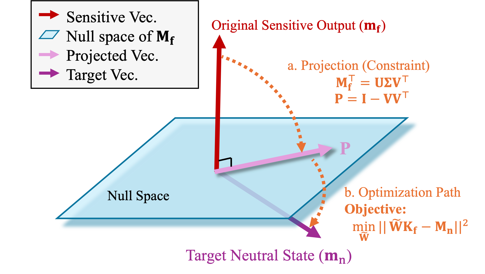

# ZeroUnlearn: Few-Shot Knowledge Unlearning in Large Language Models

> A pioneering framework that reframes machine unlearning as precise knowledge remapping through multiplicative parameter updates, achieving thorough knowledge removal while preserving model utility.

## 🏴 Overview

<p align="center">
  
</p>

Machine unlearning has become critical for responsible LLM deployment, particularly for compliance with privacy regulations, content moderation, and factual updates.

**ZeroUnlearn** is a novel framework designed for **few-shot knowledge unlearning** in LLMs. Unlike existing approaches that either require prohibitively expensive full retraining or suffer from catastrophic forgetting through aggressive fine-tuning (e.g., gradient ascent), ZeroUnlearn repurposes knowledge editing techniques to achieve precise unlearning.

### Core Idea

Rather than destructively perturbing model weights, ZeroUnlearn **overwrites sensitive information by remapping it to a predefined safe state** (e.g., the `<EOS>` token). The framework enforces a dual objective:
1. **Redirecting** sensitive inputs to a designated neutral target
2. **Orthogonalizing** the edited representations with respect to their original sensitive embeddings

This ensures that the unlearning process fundamentally projects sensitive knowledge into a null space, achieving more complete erasure while preserving the model's general capabilities.

### Key Features

* **Knowledge Remapping:** Reframes unlearning as precise knowledge editing rather than destructive weight perturbation
* **Null Space Projection:** Projects sensitive inputs into a space orthogonal to original representations for thorough removal
* **Closed-Form Solution:** Derives an optimal transformation matrix analytically, enabling efficient one-step optimization
* **Few-Shot Capability:** Achieves effective unlearning with only a small number of samples
* **Gradient-Based Extension:** Includes **ZeroUnlearn-GD**, a gradient-based variant for multi-sample batch unlearning
* **Utility Preservation:** Maintains model performance on unrelated tasks and general linguistic capabilities

---

## 📊 Main Results

The tables below show the few-shot unlearning results of ZeroUnlearn on **MCF** and **ZsRE** datasets. 

**Metrics:**
- **Eff.** (Efficacy) ↓: Lower is better - measures how well the target knowledge is removed
- **Gen.** (Generalization) ↓: Lower is better - measures unlearning generalization to paraphrased queries
- **Spe.** (Specificity) ↑: Higher is better - measures preservation of unrelated knowledge
- **PPL** (Perplexity) ↓: Lower is better - measures model fluency

### Llama-3.2-3B-Instruct

| Method | Eff. ↓ | Gen. ↓ | Spe. ↑ | PPL ↓ | Eff. ↓ | Gen. ↓ | Spe. ↑ | PPL ↓ |
|:---|:---:|:---:|:---:|:---:|:---:|:---:|:---:|:---:|
| | **MCF** | | | | **ZsRE** | | | |
| Base | 18.20±3.84 | 20.30±5.33 | 19.60±3.47 | 12.88±0.00 | 32.82±4.09 | 32.23±4.16 | 28.12±2.65 | 12.88±0.00 |
| GA | 2.00±3.34 | 1.80±2.89 | 1.06±1.79 | >1000 | 1.41±1.36 | 1.16±1.42 | 3.53±1.41 | >1000 |
| FT | 0.00±0.00 | 0.00±0.00 | 0.00±0.00 | 18.25±1.28 | 28.83±3.96 | 27.70±3.34 | 26.80±2.57 | 13.24±0.11 |
| ROME | 18.20±3.84 | 20.30±5.37 | 19.50±3.51 | 12.88±0.20 | 32.80±4.20 | 32.17±4.09 | 28.05±2.66 | 12.89±0.20 |
| MEMIT | 17.00±4.22 | 18.30±4.92 | 19.20±3.62 | 12.86±0.02 | 32.32±4.00 | 31.17±4.61 | 28.01±2.60 | 12.89±0.02 |
| AlphaEdit | 2.60±2.37 | 11.80±3.94 | 18.36±3.63 | 12.84±0.02 | 29.59±3.95 | 29.90±4.67 | 27.80±2.77 | 12.88±0.04 |
| **ZeroUnlearn** | **0.40±0.80** | **4.60±2.24** | 14.90±2.93 | 13.06±0.18 | **27.85±3.87** | **27.52±3.87** | 27.73±2.70 | 13.08±0.06 |

### Llama-3.1-8B-Instruct

| Method | Eff. ↓ | Gen. ↓ | Spe. ↑ | PPL ↓ | Eff. ↓ | Gen. ↓ | Spe. ↑ | PPL ↓ |
|:---|:---:|:---:|:---:|:---:|:---:|:---:|:---:|:---:|
| | **MCF** | | | | **ZsRE** | | | |
| Base | 24.60±5.29 | 22.80±4.35 | 21.96±4.28 | 7.47±0.00 | 40.42±4.92 | 36.84±4.24 | 29.87±2.30 | 7.47±0.00 |
| GA | 1.20±1.83 | 0.90±1.81 | 0.26±0.72 | >1000 | 0.27±0.61 | 0.27±0.61 | 0.00±0.00 | >1000 |
| FT | 0.00±0.00 | 0.00±0.00 | 0.00±0.00 | 10.23±0.67 | 31.36±2.19 | 30.91±2.96 | 26.99±2.01 | 8.16±0.08 |
| ROME | 24.40±5.04 | 22.60±4.10 | 21.86±4.28 | 7.48±0.01 | 40.46±4.85 | 36.84±4.16 | 29.99±2.37 | 7.48±0.01 |
| MEMIT | 9.60±4.63 | 16.20±4.07 | 21.08±4.24 | 7.51±0.03 | 35.15±3.99 | 34.60±3.15 | 30.05±2.46 | 7.48±0.03 |
| AlphaEdit | 0.20±0.60 | 7.80±2.27 | 19.74±4.20 | 7.49±0.05 | 34.12±4.16 | 34.19±3.33 | 29.93±2.49 | 7.48±0.07 |
| **ZeroUnlearn** | **0.00±0.00** | **4.60±2.11** | 16.82±3.64 | 7.77±0.06 | **32.67±3.43** | **32.39±3.34** | 29.67±2.36 | 7.76±0.10 |

---

## ⚡️ Quickstart Guide

### 1. Environment Setup

```bash
# Clone the repository (Anonymous for review)
cd ZeroUnlearn

# Install dependencies
pip install -r requirements.txt
```

### 2. Configure Paths

Update the paths in `sh/run.sh`:

```bash
# Base directory for the project
ul_dir=/path/to/ZeroUnlearn

# Model directory (where pretrained models are stored)
model_dir=/path/to/models
```

### 3. Run Unlearning

The main entry point is `sh/run.sh`, which handles GPU allocation and launches the unlearning pipeline:

```bash
# Run ZeroUnlearn with 50 unlearning samples
bash sh/run.sh ZeroUnlearn 50
```

Or run the evaluation script directly:

```bash
python experiments/evaluate.py \
    --alg_name ZeroUnlearn \
    --model_name Llama-3.1-8B-Instruct \
    --hparams_fname Llama-3.1-8B-Instruct.json \
    --ds_name mcf \
    --unlearn_num 50 \
    --retain_num 1000 \
    --model_path_dir /path/to/models
```

### 4. Available Methods

The following unlearning methods are implemented:

| Method | Description |
|:---|:---|
| `ZeroUnlearn` | Our proposed method with closed-form solution for few-shot unlearning |
| `ZeroUnlearn_GD` | Gradient-based variant for multi-sample batch unlearning |
| `GA` | Gradient Ascent baseline |
| `FT` | Fine-Tuning baseline |
| `ROME` | Rank-One Model Editing |
| `MEMIT` | Mass-Editing Memory in Transformer |
| `AlphaEdit` | Null-space constrained editing |

### 5. Datasets

Supported datasets:
- **MCF** (CounterFact): Factual knowledge unlearning benchmark
- **ZsRE**: Zero-shot Relation Extraction dataset
- **MQuAKE**: Multi-hop question answering knowledge editing

---

## 📁 Project Structure

```
ZeroUnlearn/
├── ZeroUnlearn/          # Main ZeroUnlearn implementation
├── ZeroUnlearn_GD/       # ZeroUnlearn with gradient descent
├── AlphaEdit/            # AlphaEdit baseline
├── memit/                # MEMIT baseline
├── rome/                 # ROME baseline
├── baselines/            # Other baseline methods (GA, FT, MEND)
├── experiments/          # Evaluation scripts
├── glue_eval/            # Downstream evaluation
├── dsets/                # Dataset loaders
├── hparams/              # Hyperparameter configurations
├── sh/                   # Shell scripts
├── util/                 # Utility functions
└── images/               # Figures and diagrams
```

---

## ❓ FAQ

### Q: What hardware is required?

**A:** Our experiments were conducted on servers with NVIDIA GPUs (A100/A800). A single GPU with 40GB+ memory is recommended for 8B models, while 3B models can run on GPUs with 24GB memory.

### Q: How do I add a new model?

**A:** Create a new hyperparameter JSON file in `hparams/ZeroUnlearn/` following the existing templates. Key parameters include layer indices and module templates specific to your model architecture.

### Q: Can I use custom datasets?

**A:** Yes! Implement a new dataset class in `dsets/` following the existing patterns. The dataset should provide `prompt`, `subject`, `target_true`, and `target_new` fields.

---

## 🙏 Acknowledgements

Our framework builds upon the excellent work of:
- [**MEMIT**](https://github.com/kmeng01/memit) - Mass-Editing Memory in a Transformer
- [**ROME**](https://github.com/kmeng01/rome) - Rank-One Model Editing
- [**AlphaEdit**](https://github.com/jianghoucheng/AlphaEdit) - Null-space constrained editing

---

## 📄 License

This project is licensed under the MIT License.
